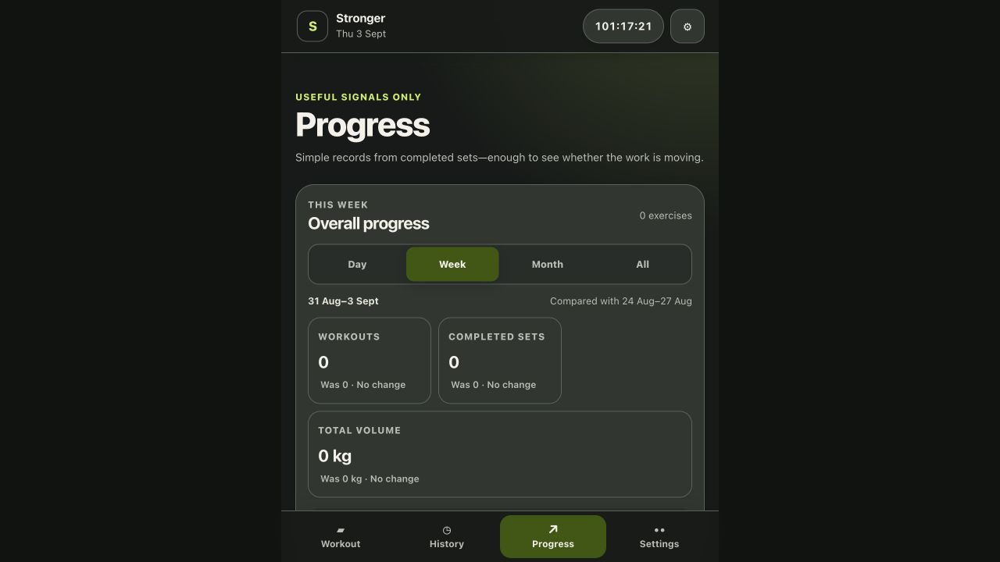
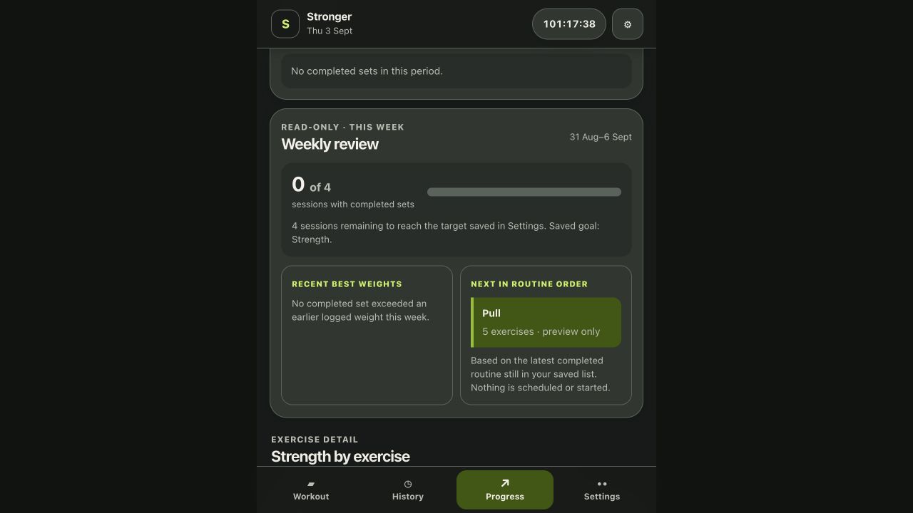
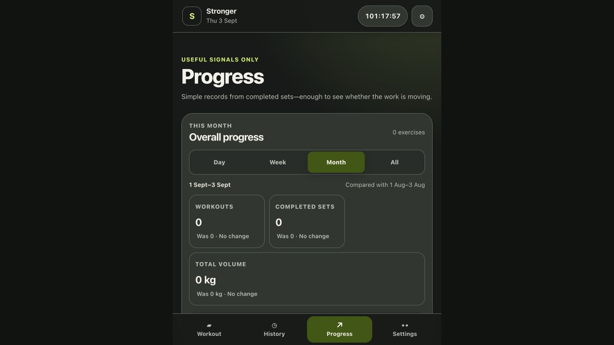
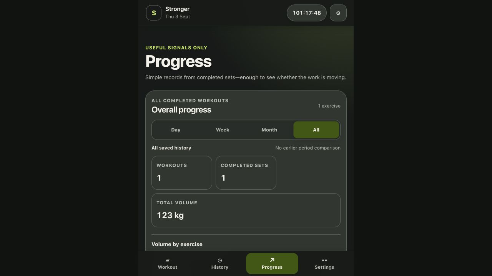

# Stronger weekly and monthly reporting audit

Date: 3 September 2026
Scope: current Progress screen, weekly review, monthly filter, report semantics, drop-set integration, UX, and accessibility. No application code was changed.

## Executive decision

Stronger should separate two ideas that are currently mixed together:

1. **Live progress** answers “How is this week/month going so far?” and uses matched elapsed-day comparisons.
2. **Completed reports** answer “What happened in that finished week/month?” and can be browsed historically.

The renovated experience should keep Stronger’s compact, local-first style, but turn the current collection of totals into a short narrative: **adherence → training dose → progression → distribution → next action**.

## Current-screen evidence

### 1. Live weekly totals

General health: visually clean, compact, and easy to scan. The date ranges and previous-period comparison are visible. In the captured state, however, an active workout is excluded without explanation and the all-zero cards repeat information without helping the user decide what to do.

### 2. Weekly review

General health: the session target, semantic progress bar, strict best-weight records, and next routine are valuable. The card is disconnected from the weekly totals above it, so users must reconcile two “week” modules with different end dates: Monday-to-today and Monday-to-Sunday.

### 3. Monthly filter

General health: month-to-date is correctly compared with the same elapsed dates of the previous month. This is a useful live dashboard, but it is not yet a monthly report: there is no completed-month summary, calendar, historical navigation, trend, distribution, or report-specific conclusion.

### 4. Populated summary

General health: Stronger already has trustworthy base metrics and clear unit display. With sparse history, the screen still presents all-time exercise records as if they are equally meaningful, even though one data point cannot establish a trend.

## Research findings to design around

### Reporting and behavior change

- A 2024 systematic review found a small positive effect of feedback in physical-activity interventions, but could not identify one superior presentation format because the studies were heterogeneous. Reports should therefore be useful and transparent rather than gamified as if the layout itself is proven. ([Krukowski et al.](https://pmc.ncbi.nlm.nih.gov/articles/PMC10765525/))
- A systematic review of just-in-time feedback proposed three practical characteristics: **timely, personalized, and action-oriented**, anchored to a known goal. Raw totals alone are weaker than “what changed, relative to your goal, and what can you do next?” ([Schembre et al.](https://pmc.ncbi.nlm.nih.gov/articles/PMC5887039/))
- Apple’s useful pattern is a short-term window against a longer personal baseline: the last 7 days of intensity and duration versus the previous 28 days. Stronger should use a rolling personal baseline as context, not a medical readiness score. ([Apple Training Load](https://support.apple.com/en-by/guide/watch/apde4c07a6cf/watchos))

### Resistance-training evidence carried forward from the routine research

- For healthy adults, the 2026 ACSM position stand emphasizes high-effort resistance training at least twice weekly across all major muscle groups. Strength is enhanced by heavier loading, while hypertrophy is enhanced by higher weekly set volume. ([ACSM 2026](https://pmc.ncbi.nlm.nih.gov/articles/PMC12965823/))
- Progressive overload can come from load, volume, frequency, exercise selection, or duration. A report must not equate “more tonnage” with the only form of progress.
- Training to failure is not required; roughly 2–3 repetitions in reserve can be sufficient. Optional RPE/RIR belongs in the report as context, not as a pass/fail score.
- Hypertrophy can occur across a broad loading range, while heavier loads are more specific to maximal strength. Rep and load trends should remain exercise-specific. ([Loading continuum review](https://pmc.ncbi.nlm.nih.gov/articles/PMC7927075/))

### Drop-set findings carried forward

- A drop set should remain one working set with linked continuations, each with its own weight and reps.
- Common research protocols reduce load by about 20–25% with little rest, but there is no single mandatory reduction. ([2023 drop-set review](https://pmc.ncbi.nlm.nih.gov/articles/PMC10390395/))
- Drop sets appear to produce similar long-term strength and hypertrophy to volume-matched traditional sets while saving time, but with more acute perceived effort and fatigue. They are a technique, not a weekly target or automatic badge of better training. ([2026 drop-set review](https://pmc.ncbi.nlm.nih.gov/articles/PMC13043944/))

## Existing product solutions

| Product | Useful pattern | What Stronger should borrow | What not to copy blindly |
|---|---|---|---|
| Hevy | Last-7-day body graph; sets per muscle over time; totals for workouts, duration, volume, and sets; completed-month report with PRs, calendar, muscle distribution, and top exercises | Completed-period report, calendar, category distribution, and month-over-month context | Hevy exposes only the latest completed monthly report; Stronger should allow historical browsing. Muscle allocation also needs transparent classification. |
| Fitbod | Weekly/monthly report delivery, period and custom-date filters, prior-period comparisons, duration, muscle strength, and muscle volume | A report-ready entry point, custom ranges later, and a clear hierarchy from totals to body area to exercise | Do not invent an opaque “muscle strength score” or calories without reliable inputs. |
| Apple Fitness | 7-day load compared with the previous 28 days, using duration and effort; drill-down to individual workouts | Personal rolling baseline and session drill-down | Do not label a simple lifting-log estimate as recovery, strain, safety, or readiness. |
| Strong | Advanced charts, measurements, muscle heat map, scheduling, sharing, and export | Exercise trend depth and optional sharing/export | Avoid expanding the first renovation into measurements, social features, and scheduling at once. |

Sources: [Hevy statistics](https://help.hevyapp.com/hc/en-us/articles/35702030346903-Hevy-Statistics-Explained-Track-Your-Training-Progress-and-Muscle-Growth), [Fitbod workout report](https://help.fitbod.me/hc/en-us/articles/16436302450711-Your-Workout-Report), [Strong feature overview](https://www.strong.app/).

## Stronger today: strengths and gaps

### Strengths to preserve

- Current week and month use matched elapsed-day comparisons, avoiding an unfinished period versus a completed period.
- Sessions count only when completed work exists.
- Working sets, drop segments, and incomplete rows already have explicit semantics.
- Volume is calculated from completed weight × reps; bodyweight work can still count as a set even when external-load volume is zero.
- Drop continuations add volume without inflating working-set counts or best weight.
- Weekly target progress uses an actual progress-bar role; period controls use pressed state and 44-pixel targets.
- Estimated 1RM is labeled as an estimate and restricted to 1–12 reps.

### Structural risks

1. **Two competing weekly stories.** “Overall progress” ends today while “Weekly review” ends Sunday. Both are correct, but the relationship is unexplained.
2. **Monthly is only a filter.** There is no finished-month artifact, history picker, monthly calendar, or conclusion.
3. **Tonnage dominates.** Workout mix, equipment, bodyweight movements, and drop sets can change volume without indicating better or worse progress.
4. **Goal is decorative.** The saved Strength/Muscle/Fitness goal appears in copy but does not change metric priority.
5. **Strict weight PRs miss progress.** More reps at the same load, improved estimated 1RM, more consistent training, and better effort control are not summarized.
6. **No category coverage.** Built-in exercises have broad categories, but the report does not aggregate them. Custom exercises have no category metadata, and compound lifts do not encode secondary muscles.
7. **No duration or effort summary.** Both are already available or derivable, but absent from period reports.
8. **Sparse-data confidence is weak.** One workout is displayed as a trend; zeros repeat without explaining excluded active/incomplete work.
9. **Exercise detail loses period context.** The selector below the period report shows all-time records regardless of the active week/month filter.
10. **Accessibility needs a chart fallback.** Selected tabs have programmatic state, but visual selection leans heavily on color. Trend values need a text/table equivalent and keyboard-verifiable semantics. W3C recommends not relying on color alone. ([W3C G111](https://www.w3.org/WAI/WCAG22/Techniques/general/G111))

## Renovated report model

### Information architecture

Use one Progress entry point with two subviews:

- **Live** — This week / This month / All time.
- **Reports** — completed weeks and months, with previous/next navigation.

The first card on every report should answer one sentence: “You completed 3 of 4 planned sessions; volume was similar to your 4-week norm; bench performance improved.” Every sentence must link to the underlying metric or session list.

### Weekly report

Order the screen this way:

1. **Header:** “Week of 31 Aug–6 Sept”, status “Live” or “Complete”, previous/next controls.
2. **Adherence:** sessions completed versus personal target; days trained calendar; longest gap only if useful.
3. **Training dose:** working sets, drop continuations, reps, external-load volume, total duration, and average session duration.
4. **Personal comparison:** previous matched week plus a 4-week rolling median/baseline. Avoid universal red/green judgments.
5. **Coverage:** broad category set counts and days trained. Show “Unclassified” for custom exercises rather than guessing.
6. **Progress highlights:** weight PR, rep-at-weight PR, and estimated-1RM improvement, all exercise-specific and based on working sets.
7. **Effort context:** median RIR/RPE and number of recorded versus unrecorded working sets. Never infer missing effort.
8. **Session timeline:** each workout with date, duration, working sets, drops, and volume; tap through to existing History detail.
9. **Next action:** a conservative, user-controlled prompt such as “1 session remains; Pull is next in your saved rotation.” Do not auto-edit routines.

### Monthly report

Use the same metric definitions, but emphasize consistency and trend:

1. Completed-month header and historical month picker.
2. Calendar heatmap/dot calendar of workout days, with a text list fallback.
3. Workouts, target adherence by week, working sets, drops, reps, duration, and external-load volume.
4. Previous full month comparison plus a 3-month trend; the current live month remains matched month-to-date.
5. Category distribution and category frequency by week.
6. PRs and top exercise progression; separate “most trained” from “most improved.”
7. Average session duration and volume, so a longer month does not win by totals alone.
8. Data-quality note: unclassified exercises, missing effort, bodyweight-only work, and partial sessions.
9. Export/share later: print-friendly report and CSV, entirely opt-in.

## Metric and edge-case rules

| Case | Report behavior |
|---|---|
| Working set | Counts as one set when completed with reps greater than zero. |
| Drop continuation | Counts under “Drops”, not “Working sets”; contributes weight × reps to external-load volume; cannot create a PR or estimated 1RM highlight. |
| Incomplete set/drop | Excluded everywhere; show an explanation only when it makes an apparently empty report surprising. |
| Drop-only corrupted exercise | Reject during import; never repair or count silently. |
| Bodyweight at 0 kg | Counts sets and reps, adds 0 kg external-load volume, and triggers a short “external load excludes body mass” note. |
| Assisted movement / negative load | Unsupported by the current nonnegative model; do not fake volume until the data model explicitly supports assistance. |
| Dumbbells or unilateral work | Keep the recorded value exactly as entered; do not double weight or reps without an exercise-level convention. |
| Custom exercise | Group by stable exercise key; category is “Unclassified” until the user assigns one. |
| Compound exercise | Count its primary built-in category only in version 1; label the limitation. Add multi-muscle weights only with an explicit taxonomy later. |
| Current week/month | Compare Monday-to-today or month-start-to-today against the same elapsed days in the previous period. Label “Live”. |
| Completed report | Compare full week to full previous week, or full month to full previous month. Label “Complete”. |
| Week boundary | Keep Monday–Sunday initially; add a week-start preference later without rewriting workout dates. |
| Time zone | Use the workout’s saved local date; do not regroup historical workouts after travel or time-zone changes. |
| Active workout | Exclude until saved, but say “Active workout not included yet” when it is the reason totals look incomplete. |
| One data point | Show the value, but say “More sessions needed for a trend.” |
| Missing effort | Exclude from effort averages and show coverage, for example “RIR recorded on 8 of 12 working sets.” |
| Goal change | Use the current goal to prioritize the report; do not rewrite historical facts or imply the old month followed the new goal. Persist goal-at-period only if later needed. |
| Unit change | Store kg as today and convert display values consistently; never compare rounded display values. |
| Renamed/deleted routine | Historical session remains; next-routine logic only uses routines still present. |
| Extremely large valid value | Include it but make the session discoverable; future editing/correction should happen in History, not inside the report. |
| No workouts | Replace repeated zero cards with one explanation and the next safe action. |

## Delivery plan

### Phase 0 — metric contract and tests

- Create one `reportMetrics` derivation used by Live and Reports.
- Add explicit outputs for reps, duration, working sets, drops, effort coverage, categories, data-quality flags, and rolling baseline.
- Lock every rule in the edge-case table with pure tests before UI work.
- Keep all derivations read-only; no report snapshot is required initially.

### Phase 1 — unify the live weekly experience

- Merge “Overall progress” and “Weekly review” into one live weekly report.
- Preserve matched elapsed-day comparison and next-routine preview.
- Add duration, reps, drops, category coverage, and active-workout exclusion copy.
- Make exercise details inherit the selected period.

### Phase 2 — completed weekly and monthly reports

- Add the Live/Reports switch, completed-period navigation, monthly calendar, session drill-down, and full-period comparisons.
- Add 4-week and 3-month personal baselines using medians where outliers would distort the story.
- Add honest sparse-data and unclassified-exercise states.

### Phase 3 — goal-aware highlights

- Strength: prioritize exercise-specific best weight, rep PR, and estimated 1RM trend.
- Muscle: prioritize weekly working sets by broad category, frequency, and effort coverage; do not prescribe a rigid target automatically.
- General fitness: prioritize consistency, duration, exercise variety, and sustainable change.
- Keep recommendations explainable, optional, and non-medical.

### Phase 4 — accessibility and portability

- Provide data tables or concise text summaries for every chart.
- Add non-color selected states, visible focus, meaningful chart labels, and reduced-motion behavior.
- Verify keyboard use, screen-reader reading order, 200% zoom/reflow, 320 px layout, light/dark contrast, empty states, and large-number wrapping.
- Add print/PDF and CSV report export only after the on-screen report is stable.

## Acceptance criteria for the first renovation

- A user can distinguish a live period from a completed report without reading help text.
- Weekly and monthly reports use the same documented counting rules.
- Working sets and drop continuations are visible as separate counts; volume includes both and says so.
- The report never calls bodyweight work “0 work”.
- Every comparison names its date range and baseline.
- Every insight can be traced to exercises or sessions.
- No chart depends on color, hover, or a single visual mark for meaning.
- Sparse and empty states explain what is excluded and offer one relevant next action.
- The report does not calculate calories, recovery, injury risk, or an opaque muscle-strength score from unavailable data.

## Evidence limits

The product audit used the current local app and its available saved history, which was sparse: one completed set plus an unfinished active workout. This was enough to verify hierarchy, empty states, date semantics, controls, and populated all-time behavior, but not dense multi-month chart layout. The research applies primarily to healthy adults and general physical-activity feedback; it does not validate a specific Stronger report layout or medical/fatigue recommendation engine.
