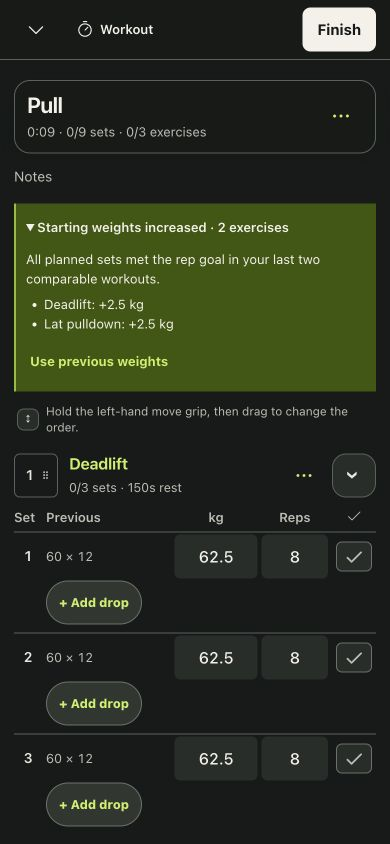
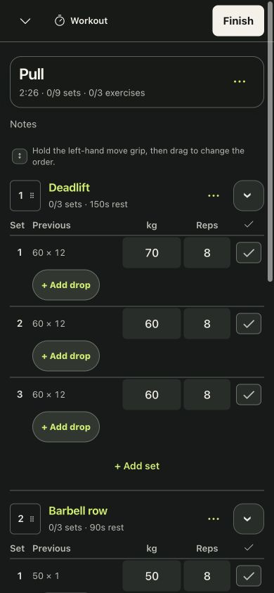
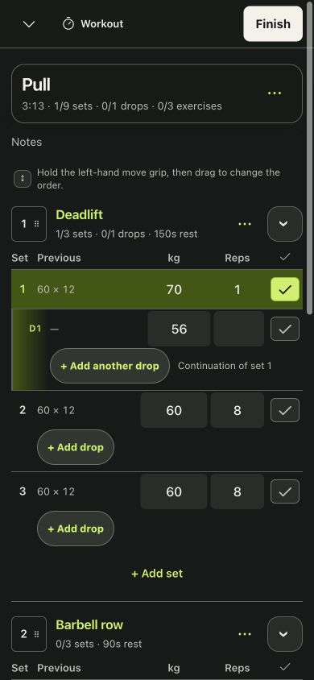
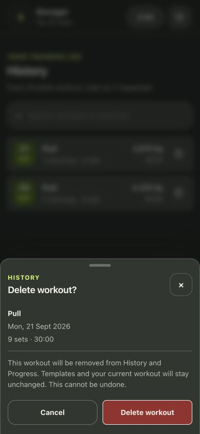
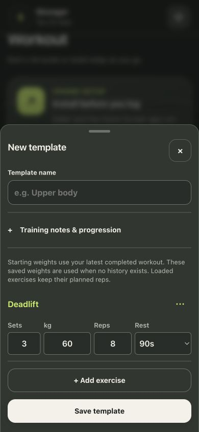
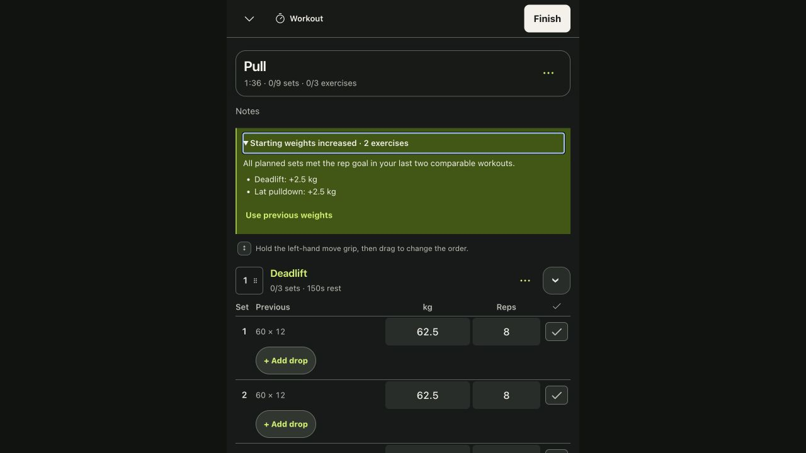
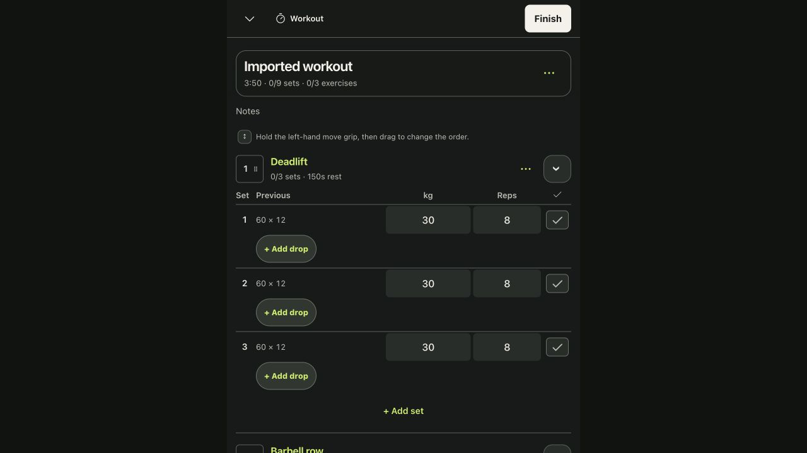

# Starting-weight update: correctness and scope audit

Date: 22 September 2026. Target: PR #10 against `a97ad03` (the pre-update main branch). Initial PR head: `d5814a6`. The audit used fresh in-app browser captures, synthetic workout data, the complete code diff, and executable regression tests. It did not access or alter the user's saved workouts.

**Verdict: corrected four issues; the requested weight behavior passes the audited cases.** Two unrelated behavior changes were reverted. Two defects in the new feature were fixed. Compact layout, palette, exercise order, History deletion, rest/drop behavior and other existing features were retained.

## Findings and corrections

| Finding | Evidence | Resolution |
| --- | --- | --- |
| Reps-only templates stopped carrying forward previous reps, although the request concerned weights. | Code comparison and regression: push-up plan 8 / previous 12 started 8. Related to step 5. | Restored historical reps for nonweighted tracking, plus the original time/distance and lookup behavior. Loaded exercises retain planned reps as required for the one-rep fix. |
| The new chronological/cumulative Previous lookup also changed blank and History-repeat workouts. | Code comparison and regression cases with backdated history and repeated rows. Related to step 3. | Restored their original history-order/per-row lookup. The new lookup is limited to loaded template exercises. |
| An older prepared 8–12-rep template increased at 8 while a newly created identical template waited for 12. | Actual prepared-template constructor regression, with the new optional goal omitted to represent an old save. Related to step 5. | Recognize the exact older library-generated range prefix when it still matches the saved plan; explicit user goals take precedence. No notes or old records rewritten. |
| Increase explanation/undo disappeared on reload and could remain above a different imported workout. | React-only state lifecycle in the initial diff; step 6 verifies corrected reload and import behavior in real local persistence. | Store small validated per-set adjustment metadata inside the workout. Reconstruct the notice from that workout alone; clear it on undo. Never rerun progression during reload/import. |

## Captured flow

### 1. Start a template — healthy

At 0/9 completed sets, Deadlift starts 62.5kg from previous 60kg after two complete 12-rep workouts. Its planned reps remain 8. The row with a previous one-rep miss stays 50kg×8. The order remains Deadlift, Barbell row, Lat pulldown. The explanation is compact and expandable.

### 2. Edit a load and use previous weights — healthy

The manual 70kg first-set edit survives. Untouched Deadlift sets return 60kg and pulldowns return 40kg. No set is marked complete. The corrected implementation additionally announces the undo through the existing status message.

### 3. Log one rep and add a drop — healthy; surrounding behavior retained

Logging 70kg×1 creates no increase prompt and leaves subsequent working sets 60kg×8. Add drop still creates a 56kg continuation using the existing 20% reduction. Drops remain separate from working-set counts. Adding a drop still clears the rest timer, exactly as before this PR; it is not a new timer change.

### 4. Open History deletion — healthy; unchanged

The visible trash action opens the existing confirmation with the correct workout/date/count. Cancel has initial focus. The warning still says templates/current workout stay unchanged. The audit did not delete a workout. The deletion handler is unchanged and its data behavior remains covered by tests.

### 5. Add an exercise to a new template — healthy

Selecting the exact Deadlift identity immediately fills 60kg from its History in another template, with 3 sets and 8 planned reps. Unknown exercises retain the existing default. Existing prepared-range compatibility and nonweighted restoration are verified by executable tests, not inferred from this screenshot.

### 6. Reload and import another workout — corrected and verified

A separate empty local origin was seeded via normal Import JSON with a synthetic progressed workout. Reload retains 62.5/50/42.5kg, 0/9 completed sets, the explanation, and the undo control. Enter operates the disclosure, with a visible focus ring. Importing a different synthetic workout with 30kg sets shows no stale increase notice and does not adjust those loads.

## Unchanged features and evidence limits

Diff and handler comparison found no unrelated changes to History delete/detail/repeat construction, set completion, rest/pause/resume timers, drop-set creation/removal, exercise order/reordering, Progress calculations, program blocks, exercise catalog/media, JSON/CSV exports, or the cream/charcoal/lime/red palette. The only style changes in the PR replace the retired in-workout prompt with the requested starting-weight notice. Existing records remain intact; new metadata is optional and old backups remain readable.

Production build and **223 tests pass**. ESLint and whitespace checks pass. Coverage includes single reps, skipped/incomplete workloads, old/new rep ranges, low-load caps, pounds, matching load conventions, immutable inputs, schema validation, backup roundtrips and the two scope reversions.

Accessibility evidence: native labeled inputs/buttons, pressed completion state, a named modal with initial Cancel focus, and keyboard-operated disclosure with visible focus. Screenshots at 390px and 1280px show readable controls without observed clipping; the desktop document width equals the viewport. Undo removes its focused button, so keyboard focus recovery deserves a later dedicated accessibility pass. Full screen-reader behavior, exhaustive contrast compliance, real iPhone background/offline behavior and every large-data scenario were not tested. This is not a claim of complete WCAG compliance or of exercise readiness assessment.

The first four captures document the initial audited flow; the final two steps include the corrected implementation. All screenshots were captured, saved, reopened and inspected during this audit run. Per-step notes are stored beside the images. The software fixes have regression coverage; there are no remaining blocking findings in the audited scope.
